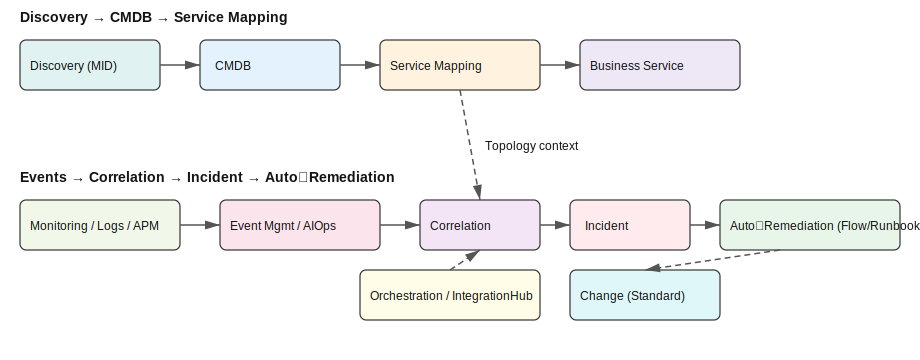

# Dokumentasi Platform ServiceNow

## 1. Apa itu ServiceNow?

ServiceNow adalah platform perangkat lunak berbasis cloud yang mendukung Manajemen Layanan TI (ITSM). Ini membantu mengotomatiskan Manajemen Bisnis TI. Ini dirancang berdasarkan pedoman ITIL untuk menyediakan orientasi layanan untuk tugas, aktivitas, dan proses. <mcreference link="https://www.guru99.com/servicenow-tutorial.html" index="1">1</mcreference>

Platform ServiceNow disebut "Now", dan semua produk ServiceNow dibangun di dalamnya. Platform ini menyediakan tumpukan teknologi tunggal untuk berbagai departemen, alur kerja, dan proses perusahaan. Platform ini berada di atas data dan sistem perusahaan yang ada untuk membantu meminimalkan penyebaran digital dan memfasilitasi transformasi digital. <mcreference link="https://www.techtarget.com/searchitoperations/definition/ServiceNow" index="3">3</mcreference>

## 2. Untuk Apa ServiceNow Digunakan?

ServiceNow digunakan untuk menghubungkan dan mengotomatiskan alur kerja di seluruh perusahaan dengan satu platform AI untuk transformasi bisnis. <mcreference link="https://www.servicenow.com" index="2">2</mcreference> <mcreference link="https://www.servicenow.com/now-platform.html" index="4">4</mcreference>

Beberapa kegunaan utama ServiceNow adalah:

*   **Manajemen Layanan TI (ITSM):** Mengelola insiden, masalah, perubahan, dan permintaan layanan.
*   **Manajemen Operasi TI (ITOM):** Mendapatkan visibilitas ke dalam infrastruktur dan aplikasi TI.
*   **Manajemen Sumber Daya Manusia (HRSD):** Mengotomatiskan proses SDM seperti orientasi dan permintaan karyawan.
*   **Manajemen Hubungan Pelanggan (CSM):** Mengelola interaksi dan hubungan pelanggan.
*   **Membangun Aplikasi Kustom:** Pengembang dapat membangun aplikasi bisnis di atas Platform Now.

## 3. Konsep Utama

*   **Platform Tunggal, Model Data Tunggal:** ServiceNow menggunakan arsitektur dan model data terpadu yang membantu menyatukan proses bisnis dan memastikan semua produk yang diimplementasikan bekerja sama. <mcreference link="https://www.techtarget.com/searchitoperations/definition/ServiceNow" index="3">3</mcreference>
*   **Otomatisasi Alur Kerja:** Automation Engine adalah teknologi otomasi proses robotik (RPA) yang membantu pengguna menghubungkan ratusan sistem pihak ketiga ke ServiceNow dan mengotomatiskan pekerjaan berulang tanpa perlu pengkodean. <mcreference link="https://www.techtarget.com/searchitoperations/definition/ServiceNow" index="3">3</mcreference>
*   **Kecerdasan Buatan (AI):** Platform ServiceNow mengintegrasikan AI untuk membantu bisnis memprediksi masalah, mengantisipasi tren, dan memprioritaskan sumber daya. <mcreference link="https://www.techtarget.com/searchitoperations/definition/ServiceNow" index="3">3</mcreference>

## 4. Sumber Daya Pengembang

*   **Portal Pengembang ServiceNow:** [developer.servicenow.com](https://developer.servicenow.com) adalah sumber daya yang bagus untuk pengembang. Ini menyediakan:
    *   Referensi API skrip.
    *   Pelatihan dan dokumentasi gratis.
    *   Akses ke instans pengembang pribadi gratis. <mcreference link="https://therockethq.gitbooks.io/servicenow1/content/index/index/fundamentals/fundamentals-concepts/development/developer-documentation.html" index="4">4</mcreference>
*   **Komunitas Pengembang:** [Komunitas Pengembang ServiceNow](https://www.servicenow.com/community/developer/ct-p/Developer) adalah tempat untuk mendapatkan pembaruan, bertanya, dan berkolaborasi dengan pengembang lain. <mcreference link="https://www.servicenow.com/community/developer/ct-p/Developer" index="2">2</mcreference>

## 5. Produk dan Modul Inti ServiceNow

### 5.1 ITSM (IT Service Management)
- Ringkasan: ITSM di ServiceNow umumnya mencakup Incident, Problem, Change, Request/Service Catalog, dan Knowledge untuk mengelola siklus layanan TI end-to-end. <mcreference link="https://www.servicenow.com/community/itsm-articles/it-service-management-knowledge-amp-troubleshooting-resources/ta-p/3141093" index="1">1</mcreference>
- Incident Management: bertujuan memulihkan layanan normal secepat mungkin dan meminimalkan dampak bisnis, dengan prioritas berdasarkan impact dan urgency. <mcreference link="https://www.servicenow.com/products/incident-management.html" index="1">1</mcreference> <mcreference link="https://www.servicenow.com/community/itsm-articles/an-overview-of-the-incident-management-process/ta-p/2316452" index="2">2</mcreference>
- Problem Management: fokus pada identifikasi akar penyebab insiden dan pencegahan agar tidak terulang. <mcreference link="https://www.servicenow.com/products/itsm/what-is-problem-management.html" index="5">5</mcreference>
- Service Request Management & Service Catalog: memfasilitasi permintaan layanan standar melalui portal self-service dan katalog layanan. <mcreference link="https://www.servicenow.com/products/itsm/what-is-service-request-management.html" index="3">3</mcreference>
- Knowledge Management: membangun basis pengetahuan untuk solusi berulang dan known errors, membantu percepat resolusi. <mcreference link="https://www.servicenow.com/products/itsm/what-is-problem-management.html" index="5">5</mcreference>

Contoh alur kerja ITSM (ringkas):
- Pelaporan insiden (portal/chat/email/telepon) → kategorisasi & prioritisasi → diagnosa awal → eskalasi jika perlu → pemulihan layanan → penutupan & review pasca-insiden.
- Masalah: identifikasi tren/insiden berulang → analisis akar masalah (RCA) → known error → solusi permanen/preventif → improvement.
- Permintaan layanan: submit permintaan melalui katalog → persetujuan otomatis/manual → pemenuhan (fulfillment) → penutupan dan survei kepuasan.

KPI dasar ITSM yang umum:
- MTTR (Mean Time To Restore/Resolve), First Contact Resolution, SLA compliance, backlog, dan CSAT.

Integrasi umum ITSM:
- CMDB/Discovery untuk visibilitas aset & dependensi; Event Management/AIOps untuk deteksi dini; integrasi HR/Identitas untuk on/off-boarding; notifikasi omnichannel.

Checklist ringkas ITSM (Hands‑on, verifikasi cepat):
- [ ] Portal self‑service aktif; 1 Catalog Item end‑to‑end (request → approval → fulfillment → close)
- [ ] Incident: kategori/prioritas otomatis (impact/urgency), SLA terpasang, assignment/routing berjalan
- [ ] Problem: template & RCA workflow, Known Error, artikel knowledge tertaut
- [ ] Change: tipe Standard/Normal/Emergency, kalender/CAB, risk assessment, Change policy
- [ ] Knowledge: KB tersedia, article workflow & feedback, deflection dilacak
- [ ] Notifikasi & CSAT aktif
- [ ] Dashboard KPI: MTTR, FCR, SLA compliance, backlog, CSAT

### 5.2 ITOM (sekilas)
- Ringkasan: IT Operations Management (ITOM) meningkatkan visibilitas aset dan dependensi layanan, memonitor kesehatan melalui event/telemetri, dan mengotomatiskan remediasi untuk menjaga ketersediaan layanan.
- Kapabilitas utama:
  - Discovery dan CMDB: temukan perangkat, aplikasi, dan relasi dependensi; gunakan MID Server, kredensial least-privilege, dan patterns untuk akurasi.
  - Service Mapping: pemetaan top‑down dari entry point aplikasi ke komponen infrastruktur agar insiden dapat dikaitkan ke business service.
  - Event Management/AIOps: normalisasi, deduplikasi, dan korelasi alert; hitung health score; otomatis buat incident dengan konteks CI/service.
  - Orchestrations/IntegrationHub: runbook otomatis (restart service, scaling, ticketing lintas domain) dan auto‑remediation berbasis policy/flow.
  - Ops tambahan (opsional): Cloud governance, Certificate Management, Firewall Audits & Reporting.
- Alur kerja contoh:
  1) Onboard layanan: definisikan business service → Discovery (scoped) → Service Mapping → baseline health dashboard.
  2) Integrasi monitoring (tool APM/infra/log) → Event masuk → korelasi → Incident otomatis dengan CI terkait.
  3) Auto‑remediation via Flow/Runbook → jika perubahan diperlukan, buat Change standar → verifikasi pemulihan → close.
- KPI yang disarankan: MTTA (deteksi), MTTR operasi, % deduplikasi alert, noise reduction, completeness & accuracy CMDB, false‑positive rate, auto‑remediation success rate.
- Integrasi umum: ITSM (Incident/Problem/Change), tool observability (APM/log/metrics), cloud providers, ITAM, SecOps.
- Data & keamanan: segmentasi MID Server, manajemen kredensial aman (alias/vault), penjadwalan & throttling discovery, retensi data event, prinsip least‑privilege.
- Langkah cepat memulai: pasang MID Server → definisikan satu set kredensial → jalankan discovery terbatas (subnet kecil) → hubungkan satu sumber monitoring → aktifkan rule alert‑to‑incident → tinjau dashboard health.

#### Diagram Arsitektur ITOM (SVG)

Gambar tersemat di bawah ini juga tersedia sebagai file terpisah untuk digunakan ulang:
- File: itom-architecture.svg

Catatan: Diagram menunjukkan dua alur utama ITOM: (1) Discovery memperkaya CMDB dan Service Mapping; (2) Event dinormalisasi dan dikorelasikan menjadi Incident, lalu dijalankan auto‑remediation melalui Flow/Runbook dengan guardrails Change Standar.

#### 5.2.1 Discovery & CMDB (praktik terbaik)
- Perencanaan: tentukan scope (subnet, OS, aplikasi), definisikan CI Classes & relasi utama, siapkan naming convention dan kebijakan deduplikasi.
- MID Server: pasang di segmen jaringan yang relevan, gunakan service account least‑privilege, aktifkan enkripsi komunikasi, dan atur update otomatis.
- Kredensial: kelola via credential alias/vault; pisahkan untuk Windows, Linux/Unix, perangkat jaringan, database, dan cloud.
- Penjadwalan: mulai dari subnet kecil (pilot), atur throttling/concurrency, dan jam tenang (maintenance window) untuk menghindari overload.
- Kualitas data: gunakan identification & reconciliation rules, tetapkan ownership CMDB, ukur 3C (completeness, correctness, compliance) secara berkala.
- Troubleshooting: pantau ECC Queue, Discovery Status, dan logs MID; perbaiki kredensial dan firewall/proxy bila host tidak terjangkau.

#### 5.2.2 Service Mapping
- Entry point: pilih URL/port/jasa front‑door aplikasi; gunakan pattern‑based mapping untuk konsistensi.
- Pola & dependency: perluas pattern untuk komponen khusus (message bus, cache, DB cluster), dan uji ulang setiap perubahan arsitektur.
- Hasil: asetkan business service, relasi dependency, dan impact rules agar insiden terhubung ke layanan yang tepat.

#### 5.2.3 Event Management & AIOps
- Integrasi: hubungkan APM/infra/log tools (mis. cloud monitor, syslog/agent) ke Event Management.
- Normalisasi & korelasi: terapkan de‑duplication, suppression, dan topological/temporal correlation untuk menurunkan noise.
- Health score & impact: definisikan indikator kesehatan per layanan/CI, atur policies untuk membuat Incident otomatis dengan konteks.
- Otomasi: jalankan auto‑remediation via Flow/Runbook; gunakan Change Standar untuk tindakan berulang yang berisiko rendah.

#### 5.2.4 Orchestration & Auto‑Remediation
- Runbook: buat langkah aman untuk restart service, clear cache, scale out/in, atau rotate certificate.
- IntegrationHub & Spokes: manfaatkan spoke resmi (cloud, ITSM lain, chat/Slack) untuk eksekusi terpadu.
- Guardrails: logging terstruktur, approval matrix untuk tindakan berdampak, dan rollback plan.

#### 5.2.5 Data Model & Governance
- CI model: gunakan kelas inti (server, app component, database, load balancer, storage) dan relasi dependency (Runs on, Depends on, Hosted on).
- Lifecycle: kelola status CI (install, in use, retired), lakukan archiving untuk CI usang, dan audit perubahan relasi.
- Data policies: definisikan akses baca/tulis per peran pada tabel CMDB dan log aktivitas untuk jejak audit.

#### 5.2.6 Keamanan & Kepatuhan
- Isolasi jaringan: tempatkan MID Server di segmen terkontrol; gunakan IP allowlist dan segmentasi akses.
- Privilege: prinsip least‑privilege pada kredensial discovery/orchestrations; rotasi dan vaulting rahasia.
- Kepatuhan: patuhi kebijakan data (PII/PCI/SOX) dan lakukan review berkala pada ACL/role serta enkripsi data sensitif.

#### 5.2.7 KPI & SLO ITOM
- Visibilitas: CMDB completeness/correctness/compliance, % CI ter‑mapped ke layanan.
- Operasi: MTTA, MTTR, noise reduction (%), korelasi alert success rate, auto‑remediation success rate.
- Kualitas: false‑positive/negative rate, akurasi service maps, perubahan yang membutuhkan intervensi manual.

#### 5.2.8 Rencana Rollout (Small → Medium)
- Fase 1 (4–6 minggu): fondasi CMDB (kelas inti), pilot Discovery (10–20 host), integrasi 1 sumber event, dashboard health dasar.
- Fase 2 (6–10 minggu): Service Mapping untuk 3–5 layanan prioritas, korelasi alert, pembuatan incident otomatis, 2–3 runbook standar.
- Fase 3 (10–16 minggu): perluas coverage (host/network/cloud), AIOps lanjutan, auto‑remediation terarah, hardening keamanan & governance.
- Deliverables: katalog kredensial & jadwal discovery, peta layanan, kebijakan event→incident, runbook tersertifikasi, dan laporan KPI.

#### 5.2.9 Hands‑on Lab — langkah demi langkah
Prasyarat umum:
- Instance non‑prod (PDI/UAT), akses admin terbatas untuk ITOM.
- 1 VM untuk MID Server (Windows/Linux), outbound ke ServiceNow dibuka; allowlist ke target lab.
- Service account least‑privilege untuk Windows (WMI/WinRM) & Linux (SSH), SNMP read untuk network, kredensial DB jika perlu.
- 3–5 host target di subnet lab, satu aplikasi web sederhana sebagai entry point mapping.

Checklist ringkas per langkah (untuk verifikasi cepat):
- [ ] MID Server "Up" dan terhubung; tidak ada error ECC Queue
- [ ] Kredensial alias (Windows/Linux/SNMP/DB) valid pada host sampel
- [ ] Discovery pilot sukses; CI dan relasi dasar masuk CMDB
- [ ] Aturan Identification/Reconciliation tervalidasi; 3C baseline dicapai
- [ ] Service map terbit dan lengkap; entry point dan komponen utama terdeteksi
- [ ] Sumber event terintegrasi; dedup & korelasi menurunkan noise ≥ 30%
- [ ] Policy alert→incident aktif; incident otomatis berisi konteks CI/service
- [ ] Flow/Runbook auto‑remediation lolos uji; audit trail lengkap
- [ ] Dashboard KPI/SLO tersedia; metrik MTTA/MTTR/noise/3C tercatat
- [ ] Hardening keamanan dilakukan; dokumentasi runbook & ownership tersedia

Langkah 1 — Instal & validasi MID Server
- Tindakan: unduh MID package dari instance → instalasi di VM → konfigurasikan URL instance & kunci → jalankan service.
- Verifikasi: MID status = Up; versi agent sesuai; ECC Queue tidak menumpuk error.
- Guardrails: jalankan sebagai service account terpisah; batasi outbound hanya ke domain ServiceNow yang relevan.

Langkah 2 — Buat credential alias aman
- Tindakan: buat alias untuk Windows, Linux, SNMP, dan (opsional) DB; hubungkan ke vault jika tersedia; set scope akses minimal.
- Verifikasi: tes koneksi kredensial lulus pada 1–2 host sampel.
- Guardrails: rotasi berkala; nonaktifkan akun default; audit penggunaan.

Langkah 3 — Discovery pilot (subnet kecil)
- Tindakan: buat Schedule terbatas (CIDR kecil); pilih MID; atur concurrency & throttling; jadwalkan di maintenance window.
- Verifikasi: Discovery Status = Success untuk mayoritas host; CI masuk ke CMDB dengan relasi dasar.
- Guardrails: pantau ECC Queue; hentikan jika terjadi spike error; whitelist IP scanner di firewall.

Langkah 4 — Validasi CMDB 3C & reconciliation
- Tindakan: review CI untuk duplikasi; atur Identification/Reconciliation rules jika perlu; tetapkan ownership per kelas CI.
- Verifikasi: 3C baseline → completeness ≥ 80% (pilot), correctness ≥ 90% CI prioritas.
- Guardrails: catat perubahan aturan; uji di sub‑prod terlebih dahulu.

Langkah 5 — Service Mapping untuk 1 layanan
- Tindakan: identifikasi entry point (URL/port); jalankan pattern; tambahkan step pattern untuk komponen hilang (cache/DB/broker); publish.
- Verifikasi: peta layanan menunjukkan relasi topologi lengkap; CI ter‑link ke Business Service.
- Guardrails: simpan versi pattern; uji ulang setelah perubahan arsitektur.

Langkah 6 — Integrasi 1 sumber event
- Tindakan: hubungkan tool monitoring/log (connector/generic); normalisasi field; mapping CI ke CMDB.
- Verifikasi: event masuk; dedup bekerja; korelasi topologi menurunkan noise awal ≥ 30%.
- Guardrails: mulai dari subset metric/alerts; aktifkan logging debug sementara.

Langkah 7 — Kebijakan alert → incident
- Tindakan: buat policy berdasarkan severity/impact; tentukan assignment group; aktifkan notifikasi; tautkan ke CI/service.
- Verifikasi: incident otomatis tercipta dengan konteks CI; SLA terpasang; routing benar.
- Guardrails: mulai dari kategori low‑risk; aktifkan suppression untuk flapping alerts.

Langkah 8 — Auto‑remediation (Flow/Runbook)
- Tindakan: bangun flow “Restart Service” (parameterized); tambahkan approval bila di luar jam kerja; logging & rollback (stop → start).
- Verifikasi: sukses di host uji; tercatat di audit trail; jika gagal, eskalasi manual.
- Guardrails: Change Standar untuk eksekusi rutin; pembatasan pada scope CI tertentu.

Langkah 9 — Baseline KPI & SLO
- Tindakan: ukur MTTA/MTTR, noise reduction, CMDB 3C, success rate auto‑remediation; buat dashboard.
- Kriteria keberhasilan fase pilot: noise ↓ ≥ 40%, MTTA ↓ ≥ 20%, CMDB completeness ≥ 85% (pilot), auto‑remediation ≥ 30% skenario low‑risk.

Langkah 10 — Hardening & handover
- Tindakan: segmentasi MID per zona; vaulting rahasia; dokumentasi runbook & ownership; rencana scaling ke Medium.
- Output: SOP operasi, runbook tersertifikasi, rencana perluasan coverage discovery & integrasi event.

#### 5.2.10 Risiko & Mitigasi
- Kredensial & akses berlebih → gunakan vault, alias, rotasi, dan scope minimal.
- Noise alert tinggi → terapkan normalisasi, suppression, dan korelasi bertahap; ukur penurunan noise.
- CMDB tidak akurat → tetapkan ownership, 3C review berkala, dan kebijakan reconciliation.
- Perubahan tak terkendali → standarisasi runbook & Change standar, guardrails, dan rollback.

### 5.3 HRSD (sekilas)
- Ringkasan: Human Resources Service Delivery (HRSD) menyatukan layanan SDM lintas fungsi (HR, IT, Fasilitas, Legal) dengan case & knowledge, portal karyawan, dan lifecycle events.
- Kapabilitas utama:
  - HR Case & Knowledge: klasifikasi, SLA, assignment, dan basis pengetahuan kebijakan/prosedur HR.
  - Employee Center/EC Pro: portal tunggal untuk self‑service, permintaan, dan pengumuman; personalisasi konten.
  - Lifecycle Events: onboarding, cross‑boarding, mobility/transfer, dan offboarding lintas departemen.
  - HR Services & Playbooks: katalog layanan HR, task templates, dan alur panduan resolusi.
  - Dokumen & e‑Sign: pembuatan, penyimpanan, akses aman, dan tanda tangan elektronik untuk dokumen HR.
  - Mobile & Virtual Agent: akses layanan HR dari perangkat mobile dan chatbot.
- Alur kerja contoh (onboarding): pre‑hire data capture → pemesanan perangkat/akses IT → koordinasi fasilitas & legal → day‑1 checklist → 30/60/90‑day survey & check‑ins.
- KPI yang disarankan: time‑to‑resolve, first‑touch resolution, SLA compliance, deflection rate dari portal/KB, CSAT/eNPS, backlog per kategori.
- Integrasi umum: HCM (Workday/SAP), IAM (Okta/Azure AD), ITSM/Facilities/Legal, e‑Sign (DocuSign/Adobe), payroll/budget.
- Data & keamanan: tabel HR scoped dengan ACL ketat, perlindungan PII, enkripsi dokumen, data residency, pemisahan tugas HR, masking & audit trail.
- Langkah cepat memulai: aktifkan Employee Center → definisikan 1 HR service end‑to‑end → buat 1 lifecycle template onboarding → publikasi 5 artikel KB prioritas tinggi.

Checklist ringkas HRSD (Hands‑on, verifikasi cepat):
- [ ] Employee Center aktif; navigasi, koleksi konten, dan personalisasi dasar
- [ ] 1 HR Service end‑to‑end (case template, SLA, assignment)
- [ ] 1 Lifecycle Events template onboarding aktif; tugas lintas IT/Fasilitas/Legal
- [ ] ≥ 5 artikel knowledge HR terbit; feedback aktif
- [ ] Dokumen & e‑Sign (opsional) berfungsi; akses aman
- [ ] ACL tabel HR tervalidasi; PII terlindungi (masking/audit)

### 5.4 CSM (sekilas)
- Ringkasan: Customer Service Management (CSM) menghubungkan layanan pelanggan dengan tim internal untuk resolusi proaktif, omnichannel, dan pengalaman pelanggan yang konsisten.
- Kapabilitas utama:
  - Case Management B2C/B2B: akun/kontak, entitlements, SLA, prioritisasi, dan case templates.
  - Omnichannel: email, chat, telepon/CTI, portal, dan Virtual Agent; assignment otomatis berbasis skill.
  - Knowledge & Communities: basis pengetahuan eksternal dan komunitas untuk deflection.
  - Proactive Service Operations: konversi event/telemetri produk menjadi case sebelum pelanggan menghubungi.
  - Field Service & Asset/Contract: integrasi penugasan lapangan, suku cadang, garansi/kontrak.
- Alur kerja contoh: notifikasi anomali perangkat → buat case proaktif → verifikasi entitlement → pandu pelanggan melalui langkah remediasi → jika perlu, jadwalkan teknisi lapangan → konfirmasi resolusi & survei.
- KPI yang disarankan: CSAT/NPS, First Contact Resolution, Average Handle Time, backlog, deflection rate, SLA compliance.
- Integrasi umum: CRM (Sales/Dynamics), CTI/contact center, telemetri/IoT/APM, billing/e‑commerce, email gateway.
- Data & keamanan: kepatuhan privasi (GDPR/consent), penyekatan data antar‑akun/region, kontrol akses portal, audit aktivitas agen.
- Langkah cepat memulai: definisikan produk/layanan & entitlements → buat channel utama (email/portal) → siapkan 3 case template + artikel knowledge terkait → atur routing berbasis skill.

Checklist ringkas CSM (Hands‑on, verifikasi cepat):
- [ ] Channel utama (email/portal/chat) aktif; routing berbasis skill
- [ ] Case templates & entitlements terkonfigurasi
- [ ] Knowledge/Community tersedia untuk deflection
- [ ] Proactive service ops (opsional): event→case terhubung
- [ ] Field Service (opsional) terintegrasi untuk on‑site
- [ ] SLA & dashboard: CSAT/NPS, FCR, AHT, deflection, SLA compliance
- [ ] Kontrol akses portal & visibilitas data antar‑akun/region tervalidasi

### 5.5 App Engine / Creator Workflows (sekilas)
- Ringkasan: platform low‑code/no‑code untuk membangun aplikasi kustom di atas Now Platform dengan data, proses, dan keamanan terpadu.
- Kapabilitas utama:
  - App Engine Studio & Table Builder: desain data model, formulir, list, dan pengalaman.
  - Flow Designer & IntegrationHub: otomasi proses dan integrasi menggunakan spokes (SAP, Slack, Jira, dll.).
  - UI Builder & Workspaces: bangun pengalaman agen/karyawan modern dan terarah.
  - Governance & CoE: guardrails, templat, standards, delegated development, dan kontrol rilis.
  - Kualitas & Rilis: ATF untuk test otomatis, App Repository/DevOps pipeline untuk versioning & deploy.
- Pola implementasi: intake ide → evaluasi manfaat/risiko → desain scope & data model → bangun flow & UI → terapkan ACL/roles → uji (ATF) → review arsitektur → rilis bertahap (dev→test→prod).
- KPI yang disarankan: cycle time pengembangan, defect escape rate, tingkat reuse komponen, adopsi citizen developers, kepatuhan guardrails.
- Keamanan & tata kelola: scoped apps, prinsip least‑privilege & ACL ketat, secrets/credential alias, audit trail, separation of duties.
- Langkah cepat memulai: buat aplikasi permintaan sederhana (2 tabel, 1 flow persetujuan, 1 formulir, 1 dashboard) → tambahkan 1 integrasi spoke → buat 5 ATF test → rilis via App Repo.

Checklist ringkas App Engine (Hands‑on, verifikasi cepat):
- [ ] Aplikasi dengan ≥ 2 tabel, formulir & list ditayangkan
- [ ] Flow Designer: alur persetujuan end‑to‑end berjalan
- [ ] 1 integrasi via IntegrationHub Spoke berfungsi
- [ ] UI Builder: 1 workspace/experience dipublikasikan
- [ ] Roles & ACL pada tabel; secrets via credential alias/vault
- [ ] ≥ 5 ATF test lulus
- [ ] Rilis via App Repository (Dev → Test); catatan versi dibuat
- [ ] Review guardrails/CoE disetujui

## 6. Learning Path dan Hands-on
Langkah yang disarankan bagi pemula:
1) Dapatkan Personal Developer Instance (PDI) secara gratis di portal developer.
2) Eksplor navigasi dasar dan Studio/App Engine.
3) Latihan: buat tabel dan form sederhana, relasi dasar, dan list layout.
4) Latihan: buat satu Catalog Item dengan variabel dan alur persetujuan sederhana; uji dari portal.
5) Pelajari dasar scripting (Client Script, Business Rule) dan Flow Designer.
6) Dokumentasikan konfigurasi Anda, dan latih praktik update set.
7) Latihan lanjutan (opsional):
   - ITOM: pasang MID Server lokal → jalankan discovery subnet kecil → integrasi satu sumber event → aktifkan rule alert‑to‑incident.
   - HRSD: buat 1 layanan HR (kategori Benefits/Payroll) → 1 lifecycle template onboarding mini → 3 artikel KB dengan feedback.
   - CSM: aktifkan channel email → 3 case template → routing skill‑based → 3 artikel knowledge eksternal.
   - App Engine: bangun app kecil dengan 2 tabel → 1 flow persetujuan → 1 workspace sederhana → 5 ATF test.

## 7. Arsitektur Referensi & Praktik Terbaik
Skala Kecil (Small) dengan jalur ke Medium:
- Arsitektur: satu instance produksi + satu instance dev (atau PDI untuk belajar); gunakan scoped apps untuk modularitas.
- Keamanan: peran (role) berbasis tugas, ACL tepat sasaran (record & field), prinsip least privilege, audit log aktif, enkripsi data sensitif.
- Data: desain katalog/tabel sederhana, naming convention konsisten, tinjau SLA dan assignment rules hemat.
- DevOps: gunakan update set terstruktur, ATF untuk test regresi dasar, App Repo untuk versioning; hindari langsung di prod.
- Observabilitas: dashboard SLA & backlog, notifikasi anomali, dan review post-incident berkala.

Skala Menengah (Medium) penguatan:
- Tambah instance test/UAT, branching lebih disiplin, pipeline CI untuk ATF, linting, dan audit konfigurasi.
- Hardening keamanan (IP allowlist, SSO/ MFA), data retention & DLP, pemisahan tugas (SoD).
- Integrasi CMDB/Discovery dan Event Management untuk meningkatkan MTTR dan pencegahan.

## 8. Strategi Implementasi Bertahap
- Fase 1 (0–8 minggu): ITSM inti (Incident/Request/Knowledge), portal dasar, SLA & notifikasi, metrik dan CSAT.
- Fase 2 (8–16 minggu): Problem & Change, CMDB/Discovery (opsional), otomasi tiket dari event/monitoring.
- Fase 3 (16+ minggu): perluasan HRSD/CSM/App Engine sesuai prioritas bisnis, hardening keamanan & tata kelola.

## 9. Etika & Tata Kelola AI
- Gunakan AI/Now Assist secara bertanggung jawab: jelaskan penggunaan AI, jaga privasi data, audit output AI untuk bias, dan sediakan opsi human-in-the-loop.
- Tetapkan kebijakan data (akses, retensi, masking), dan catat jejak (traceability) untuk rekomendasi/otomasi.

### Target KPI minimum per modul (pilot → rollout)

- ITSM
  - MTTR (Incident) ≤ 8 jam (pilot) → ≤ 4 jam (rollout)
  - MTTA ≤ 30 menit (pilot) → ≤ 15 menit (rollout)
  - SLA compliance (Incident & Request) ≥ 90% (pilot) → ≥ 95% (rollout)
  - First Contact Resolution ≥ 60% (pilot) → ≥ 75% (rollout)
  - Knowledge deflection rate ≥ 10% (pilot) → ≥ 20% (rollout)

- ITOM
  - Noise reduction (event) ≥ 40% (pilot) → ≥ 60% (rollout)
  - MTTA (event → alert triage) ≤ 15 menit (pilot) → ≤ 5 menit (rollout)
  - CMDB 3C: completeness ≥ 85%, correctness ≥ 90%, compliance ≥ 90% (pilot) → +5% pada rollout
  - Auto‑remediation success rate ≥ 30% skenario low‑risk (pilot) → ≥ 50% (rollout)
  - Service health incidents turun ≥ 20% (pilot) → ≥ 40% (rollout)

- HRSD
  - Time‑to‑resolve (HR case) median ≤ 24 jam (pilot) → ≤ 12 jam (rollout)
  - First‑touch resolution ≥ 50% (pilot) → ≥ 65% (rollout)
  - SLA compliance ≥ 90% (pilot) → ≥ 95% (rollout)
  - Portal deflection ≥ 15% (pilot) → ≥ 30% (rollout)
  - CSAT/eNPS ≥ 4.3/5 (pilot) → ≥ 4.5/5 (rollout)

- CSM
  - First Contact Resolution ≥ 60% (pilot) → ≥ 75% (rollout)
  - Average Handle Time (AHT) turun ≥ 10% (pilot) → ≥ 20% (rollout)
  - Deflection rate ≥ 15% (pilot) → ≥ 30% (rollout)
  - SLA compliance ≥ 90% (pilot) → ≥ 95% (rollout)
  - CSAT/NPS ≥ 4.3/5 atau NPS ≥ +30 (pilot) → ≥ 4.5/5 atau NPS ≥ +40 (rollout)

- App Engine
  - Automasi: ≥ 1 proses end‑to‑end digitalized (pilot) → ≥ 3 (rollout)
  - ATF pass rate ≥ 90% (pilot & rollout)
  - Lead time perubahan (dev→test→prod) ≤ 7 hari (pilot) → ≤ 3 hari (rollout)
  - Reuse komponen (spokes/UI/flow) ≥ 20% (pilot) → ≥ 40% (rollout)
  - Defect escape rate ≤ 5% (pilot & rollout)