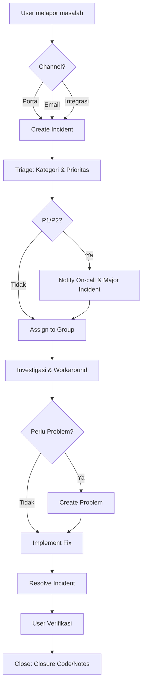
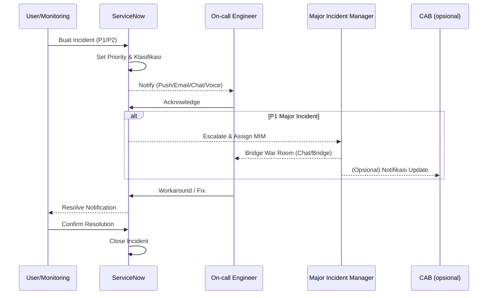
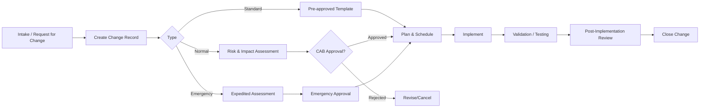
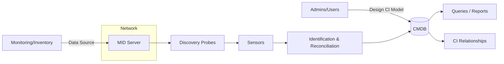
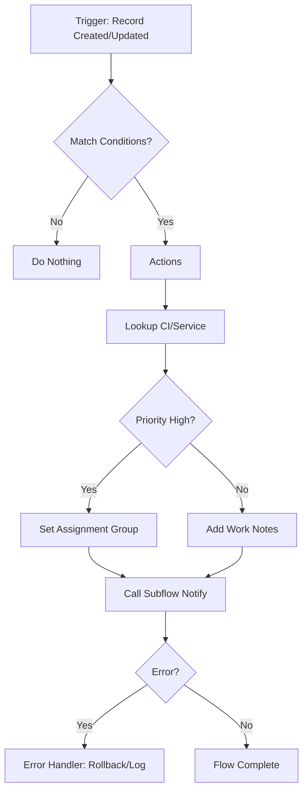

# ServiceNow Documentation

> Catatan belajar & implementasi ServiceNow. Gunakan sebagai living document—update seiring progres.

## Daftar Isi
- [1. Pendahuluan](#1-pendahuluan)
- [2. Getting Started](#2-getting-started)
- [3. Konsep Dasar & Terminologi](#3-konsep-dasar--terminologi)
- [4. ITSM](#4-itsm)
  - [Incident Management](#incident-management)
  - [Problem Management](#problem-management)
  - [Change Enablement](#change-enablement)
- [5. ITOM (Pengantar)](#5-itom-pengantar)
  - [CMDB & Discovery](#cmdb--discovery)
  - [Event Management](#event-management)
- [6. Integrasi & Otomasi](#6-integrasi--otomasi)
  - [REST API & Scripted REST](#rest-api--scripted-rest)
  - [Flow Designer](#flow-designer)
- [7. Development di ServiceNow](#7-development-di-servicenow)
- [8. Service Catalog & Request Fulfillment](#8-service-catalog--request-fulfillment)
- [9. Reporting & Dashboard](#9-reporting--dashboard)
- [10. Keamanan & Akses](#10-keamanan--akses)
- [11. Deployment & Migrasi](#11-deployment--migrasi)
- [12. Praktik Terbaik](#12-praktik-terbaik)
- [13. Runbook Ringkas](#13-runbook-ringkas)
- [14. Glosarium](#14-glosarium)
- [15. Referensi](#15-referensi)

---

## 1. Pendahuluan
Dokumen ini merangkum pembelajaran ServiceNow untuk skenario umum: ITSM, ITOM, development, serta integrasi. Target pembaca: engineer/analyst yang baru memulai namun ingin cepat produktif.

## 2. Getting Started
- Cara akses instance (trial / developer portal)
- Navigasi dasar UI ServiceNow
- Role & permission default (admin, itil, user)

## 3. Konsep Dasar & Terminologi
- **Record**: baris data dalam tabel (contoh: `incident`).
- **Table**: skema data (turunan dari `task` untuk banyak proses ITSM).
- **Form & List**: tampilan record dan daftar record.
- **Update Set / App Repo**: mekanisme memindahkan konfigurasi antar environment.
- **Scope**: ruang lingkup aplikasi (global vs scoped app).
- **ACL (Access Control List)**: kontrol akses berbasis record/field/operation.

## 4. ITSM

### Incident Management
**Tujuan**: mengembalikan layanan normal secepatnya dan meminimalkan dampak bisnis.  
**Alur standar**:
1. *Log* → buat incident (portal, email, integrasi)  
2. *Triage* → klasifikasi (kategori, prioritas via impact × urgency)  
3. *Assign* → ke assignment group/assignee  
4. *Investigate* → diagnosa & workaround  
5. *Resolve* → solusi diterapkan  
6. *Close* → verifikasi pengguna, isi *closure code/notes*  

**Tips konfigurasi**:
- Otomatiskan prioritas (BR/Flow) berdasar CI & layanan terdampak.
- Template incident untuk kasus berulang.
- SLAs: *response* & *resolution* berbasis prioritas.

#### Diagram Alur (Mermaid)


#### Sequence Notifikasi P1/P2 (Mermaid)


### Problem Management
- Tautkan **incident** berulang ke **problem**.
- Root Cause Analysis (RCA) → gunakan *Known Error* base.
- *Change* bisa dibuat dari *problem* untuk perbaikan permanen.

### Change Enablement
- Tipe: *Standard* (pre-approved), *Normal*, *Emergency*.
- Workflow: *Plan → Assess → Approve (CAB) → Implement → Review → Close*.
- Integrasi kalender rilis & blackout windows.

#### Diagram Alur (Mermaid)


## 5. ITOM (Pengantar)

### CMDB & Discovery
- **CMDB**: sumber kebenaran CI (Configuration Item) & relasi.
- **Discovery**: menemukan perangkat/aplikasi (via MID Server).
- Atur **Identification & Reconciliation** untuk mencegah duplikasi.
- Kualitas CMDB: ukur dengan *completeness, correctness, compliance*.

#### Diagram CMDB & Discovery (Mermaid)


### Event Management
- Konsumsi event dari tool monitoring → buat alert → korelasi → *auto-ticketing* opsional.
- Gunakan *alert aggregation* untuk mengurangi noise.

## 6. Integrasi & Otomasi

### REST API & Scripted REST
- **REST Table API**: CRUD terhadap tabel (contoh: `incident`).
- **Scripted REST**: endpoint kustom (logika validasi/transformasi).
- Contoh *curl* sederhana:
  ```bash
  curl -u user:pass     "https://<instance>.service-now.com/api/now/table/incident?sysparm_limit=1"
  ```

### Flow Designer
- Otomasi berbasis *low-code*.
- Flow = trigger + action.
- Contoh: otomatis assign incident dengan kategori tertentu ke group support.

#### Diagram Arsitektur Flow (Mermaid)


#### Pseudo-Flow: Assign Incident Berdasar Kategori
```text
Trigger : When Incident is created
If      : category == "network" and priority <= 2
Then    : set assignment_group = "Network Support"
          add work_notes = "Auto-assigned by Flow Designer"
          call subflow "Notify-Oncall"
```

## 7. Development di ServiceNow
- ServiceNow Studio
- Script Include
- GlideRecord (contoh query):
  ```javascript
  var gr = new GlideRecord('incident');
  gr.addQuery('priority', 1);
  gr.query();
  while (gr.next()) {
    gs.info('Incident: ' + gr.number);
  }
  ```
- API & integrasi eksternal

## 8. Service Catalog & Request Fulfillment
- Membuat catalog item
- Variabel & variable sets
- Record producer
- Workflow request approval

## 9. Reporting & Dashboard
- Membuat laporan dasar
- Membuat dashboard interaktif
- Performance Analytics (overview)

## 10. Keamanan & Akses
- **ACL** (Access Control List) – konsep dasar
- Data separation dengan domain separation
- Best practices security

## 11. Deployment & Migrasi
- Update Set management
- Application Repository
- Pipeline CI/CD (overview)

## 12. Praktik Terbaik
- Naming convention table/field/script
- Performance tuning (query index, efisiensi script)
- Testing (unit test, ATF)
- Release management

## 13. Runbook Ringkas
- Step cepat untuk triage incident
- Step standar untuk membuat request item
- Alur approval change

## 14. Glosarium
- Kumpulan istilah ServiceNow umum (Record, CI, SLA, CAB, dll)

## 15. Referensi
- [ServiceNow Docs](https://docs.servicenow.com/)
- [Developer Portal](https://developer.servicenow.com/)
- [Community](https://www.servicenow.com/community.html)
- Training & sertifikasi
