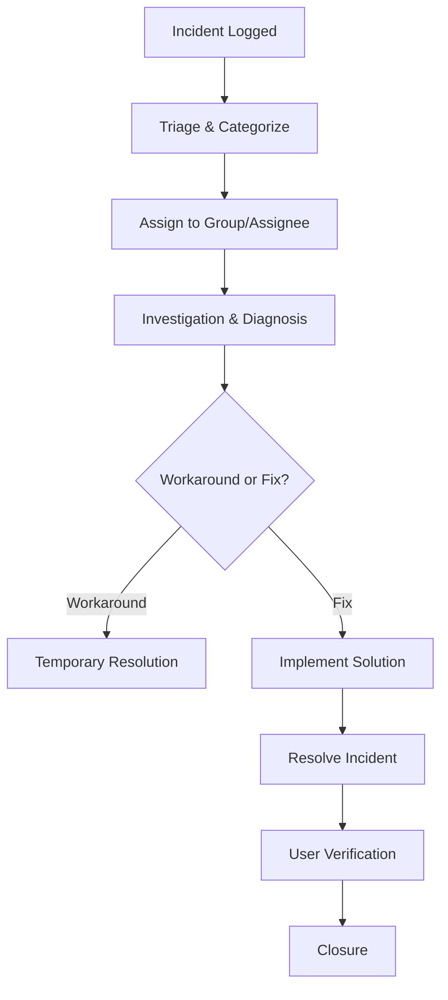
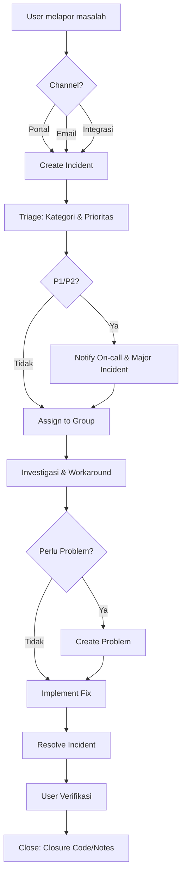
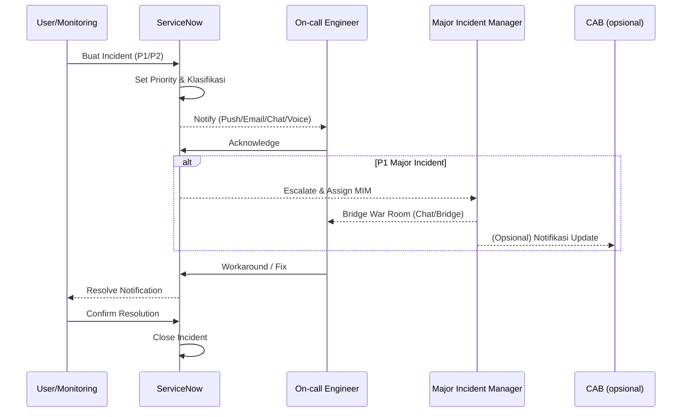
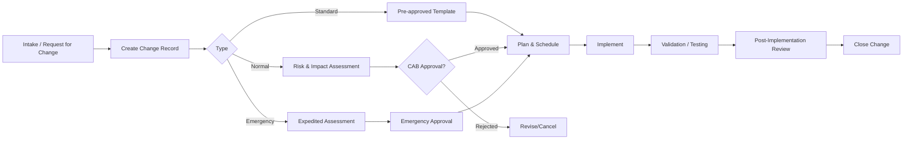
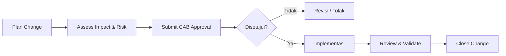
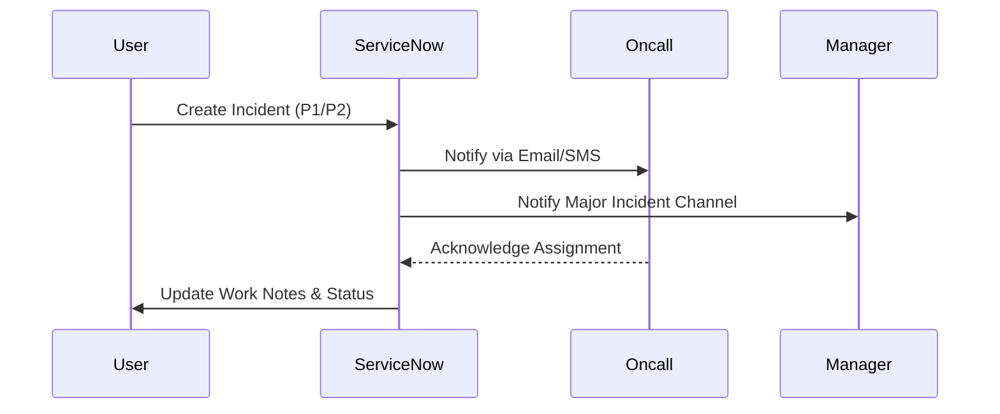
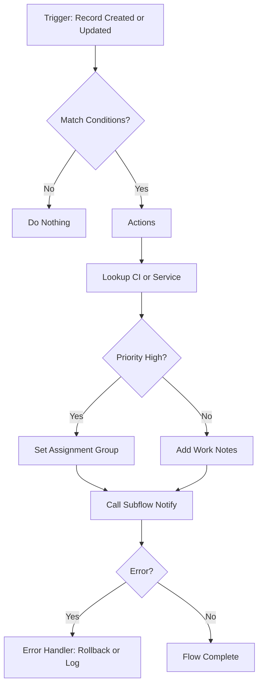
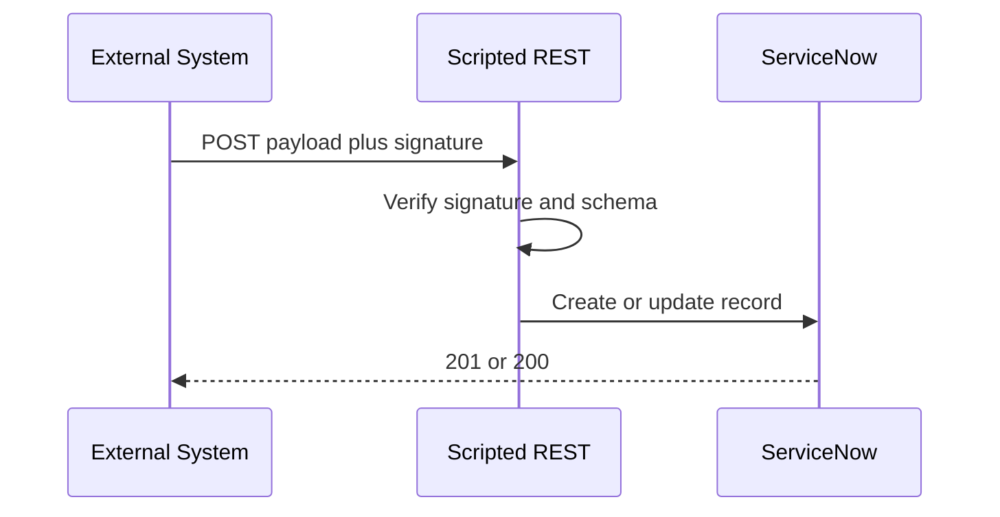
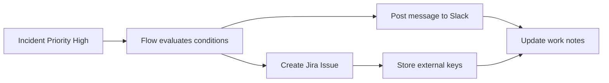
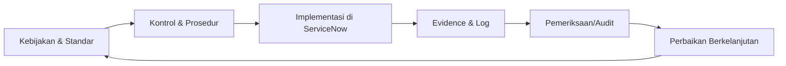

# ServiceNow Documentation

> Catatan belajar & implementasi ServiceNow. Gunakan sebagai living document—update seiring progres.

## Daftar Isi
- [1. Pendahuluan](#1-pendahuluan)
- [2. Getting Started](#2-getting-started)
- [3. Konsep Dasar & Terminologi](#3-konsep-dasar--terminologi)
- [4. ITSM](#4-itsm)
  - [4.1 Incident Management](#41-incident-management)
  - [4.2 Problem Management](#42-problem-management)
  - [4.3 Change Enablement](#43-change-enablement)
- [5. ITOM (Pengantar)](#5-itom-pengantar)
  - [5.1 CMDB & Discovery](#51-cmdb--discovery)
  - [5.2 Event Management](#52-event-management)
- [6. Integrasi & Otomasi](#6-integrasi--otomasi)
  - [6.1 REST API & Scripted REST](#61-rest-api--scripted-rest)
  - [6.2 Flow Designer](#62-flow-designer)
- [7. Development di ServiceNow](#7-development-di-servicenow)
- [8. Service Catalog & Request Fulfillment](#8-service-catalog--request-fulfillment)
- [9. Reporting & Dashboard](#9-reporting--dashboard)
- [10. Keamanan & Akses](#10-keamanan--akses)
- [11. Deployment & Migrasi](#11-deployment--migrasi)
- [12. Praktik Terbaik](#12-praktik-terbaik)
- [13. Runbook Ringkas](#13-runbook-ringkas)
- [14. Glosarium](#14-glosarium)
- [15. Referensi](#15-referensi)

---

## 1. Pendahuluan
Dokumen ini merangkum pembelajaran ServiceNow untuk skenario umum: ITSM, ITOM, development, serta integrasi. Target pembaca: engineer/analyst yang baru memulai namun ingin cepat produktif.

## 2. Getting Started
- Cara akses instance (trial / developer portal)
- Navigasi dasar UI ServiceNow
- Role & permission default (admin, itil, user)

## 3. Konsep Dasar & Terminologi
- **Record**: baris data dalam tabel (contoh: `incident`).
- **Table**: skema data (turunan dari `task` untuk banyak proses ITSM).
- **Form & List**: tampilan record dan daftar record.
- **Update Set / App Repo**: mekanisme memindahkan konfigurasi antar environment.
- **Scope**: ruang lingkup aplikasi (global vs scoped app).
- **ACL (Access Control List)**: kontrol akses berbasis record/field/operation.

## 4. ITSM

### 4.1 Incident Management
**Tujuan**: mengembalikan layanan normal secepatnya dan meminimalkan dampak bisnis.  
**Alur standar**:
1. *Log* → buat incident (portal, email, integrasi)  
2. *Triage* → klasifikasi (kategori, prioritas via impact × urgency)  
3. *Assign* → ke assignment group/assignee  
4. *Investigate* → diagnosa & workaround  
5. *Resolve* → solusi diterapkan  
6. *Close* → verifikasi pengguna, isi *closure code/notes*  

**Tips konfigurasi**:
- Otomatiskan prioritas (BR/Flow) berdasar CI & layanan terdampak.
- Template incident untuk kasus berulang.
- SLAs: *response* & *resolution* berbasis prioritas.

**Diagram Alur Incident Management (Mermaid)**:


#### Diagram Alur (Mermaid)


#### Sequence Notifikasi P1/P2 (Mermaid)


### 4.2 Problem Management
- Tautkan **incident** berulang ke **problem**.
- Root Cause Analysis (RCA) → gunakan *Known Error* base.
- *Change* bisa dibuat dari *problem* untuk perbaikan permanen.

### 4.3 Change Enablement
- Tipe: *Standard* (pre-approved), *Normal*, *Emergency*.
- Workflow: *Plan → Assess → Approve (CAB) → Implement → Review → Close*.
- Integrasi kalender rilis & blackout windows.

#### Diagram Alur (Mermaid)


#### Diagram Alur (Mermaid)


- Tipe: *Standard* (pre-approved), *Normal*, *Emergency*.
- Workflow: *Plan → Assess → Approve (CAB) → Implement → Review → Close*.
- Integrasi kalender rilis & blackout windows.

## 5. ITOM (Pengantar)

### 5.1 CMDB & Discovery
- **CMDB**: sumber kebenaran CI (Configuration Item) & relasi.
- **Discovery**: menemukan perangkat/aplikasi (via MID Server).
- Atur **Identification & Reconciliation** untuk mencegah duplikasi.
- Kualitas CMDB: ukur dengan *completeness, correctness, compliance*.

#### Diagram CMDB & Discovery (Mermaid)
```mermaid
flowchart LR
  subgraph Network
    MID[MID Server]
  end

  U[Admins/Users] -->|Design CI Model| CMDB[(CMDB)]
  MON[Monitoring/Inventory] -->|Data Source| MID
  MID --> PROBE[Discovery Probes]
  PROBE --> SENS[Sensors]
  SENS --> IDR[Identification & Reconciliation]
  IDR --> CMDB
  CMDB --> QRY[Queries / Reports]
  CMDB --> REL[CI Relationships]

  note right of IDR: Cegah duplikasi
  note right of CMDB: SSoT untuk CI & relasi
```

### 5.2 Event Management
- Konsumsi event dari tool monitoring → buat alert → korelasi → *auto-ticketing* opsional.
- Gunakan *alert aggregation* untuk mengurangi noise.

#### Diagram CMDB & Discovery (Mermaid)
```mermaid
flowchart TD
  A[Device/Server] --> B[Discovery Probe]
  B --> C[MID Server]
  C --> D[ServiceNow Discovery]
  D --> E[Identification & Reconciliation]
  E --> F[CMDB (Configuration Item)]
  F --> G[Relationships]
```

#### Sequence Diagram Notifikasi P1/P2 (Mermaid)



## 6. Integrasi & Otomasi

> Tujuan: menghubungkan ServiceNow dengan sistem lain secara aman, terukur, dan dapat diaudit. Bagian ini berisi pola teknis, contoh, dan praktik terbaik.

### 6.1 REST Table API (Inbound)
Gunakan untuk CRUD langsung ke tabel.
- **Endpoint contoh**: `/api/now/table/incident`
- **Query umum**: `sysparm_query`, `sysparm_fields`, `sysparm_limit`, `sysparm_display_value=true`
- **Contoh**: ambil 5 incident prioritas 1
  ```bash
  curl -u user:pass \
    "https://<instance>.service-now.com/api/now/table/incident?sysparm_limit=5&sysparm_query=priority=1"
  ```
- **Tips**: batasi field, gunakan paging `sysparm_offset`, dan aktifkan `display_value` hanya bila perlu.

### 6.2 Scripted REST API (Inbound kustom)
Gunakan ketika perlu validasi, transformasi, atau orkestra logika kompleks.
- **Struktur**: *API* ➜ *Resource* ➜ *Script* (request, response, error)
- **Contoh handler**:
  ```javascript
  // Scripted REST Resource: POST /api/x_acme/v1/ticket
  (function process(/*RESTAPIRequest*/ req, /*RESTAPIResponse*/ res) {
    try {
      var body = req.body.data;
      if (!body || !body.short_description) {
        return res.setStatus(400).setBody({error: 'short_description required'});
      }
      var gr = new GlideRecord('incident');
      gr.initialize();
      gr.short_description = body.short_description;
      gr.urgency = body.urgency || 2;
      gr.insert();
      return res.setStatus(201).setBody({number: gr.number.toString()});
    } catch (e) {
      gs.error('SRAPI error: ' + e);
      return res.setStatus(500).setBody({error: 'internal_error'});
    }
  })(request, response);
  ```
- **Gunakan**: *JWT bearer*, *OAuth 2.0*, *rate limit* via Flow Action atau BR, dan logging di `sys_logs`.

### 6.3 Outbound REST, SOAP, dan Import Set
- **Outbound REST Message** untuk panggil API eksternal. Simpan kredensial di **Connection and Credential alias**.
- **Import Set** + **Transform Map** untuk ETL batch; jadwalkan via **Scheduled Job**.
- **SOAP** hanya bila integrasi lama; utamakan REST.

**Contoh Outbound via Script**
```javascript
var r = new sn_ws.RESTMessageV2('ext_user_api','get');
// setStringParameterNoEscape('id', id);
var resp = r.execute();
if (resp.haveError()) {
  gs.error('Outbound error: ' + resp.getErrorMessage());
} else {
  var body = resp.getBody();
  // parse JSON dan proses
}
```

### 6.4 IntegrationHub dan Spokes
- **IntegrationHub** menyediakan *actions* siap pakai (Slack, Teams, Jira, GitHub, Email, Twilio, dll).
- **Spokes**: paket konektor siap pakai. Gunakan untuk menghindari skrip manual.
- **Subflow**: bungkus aksi integrasi agar dapat digunakan ulang lintas flow.

**Pola umum**
- *Trigger* (record updated) ➜ *Decision* ➜ *Action* (post to Slack, create Jira) ➜ *Update* work notes.
- Simpan *mapping* field di **Data Stream Action** atau *Lookup Table* (sys_choice atau table kustom).

### 6.5 Flow Designer – lanjutan
- **Concept**: Trigger ➜ Conditions ➜ Actions ➜ Subflow ➜ Error Handler.
- **Best practice**: kecilkan *granularity*, hindari logika bercabang sangat dalam, gunakan **Script Step** bila benar-benar perlu.
- **Retry**: aktifkan *error handler* + retry berbasis *isTransient* (HTTP 5xx, timeout).

**Diagram Arsitektur Flow**


### 6.6 Event driven dan Webhook
- **Inbound webhook**: gunakan Scripted REST sebagai endpoint; verifikasi signature HMAC.
- **Outbound webhook**: REST Message dari BR atau Flow setelah status tertentu.

**Sequence inbound webhook**


### 6.7 Email integration
- **Inbound Email Action** untuk membuat Incident atau RITM dari email.
- Pakai *prefix* pada subject untuk update otomatis, contoh: `Re: INC00123`.

### 6.8 MID Server, JDBC, File, dan Discovery
- **MID Server** untuk akses jaringan privat.
- **JDBC**: tarik data database on prem ke Import Set.
- **SFTP**: ambil file CSV lalu transform ke tabel target.

### 6.9 Keamanan dan Kredensial
- Gunakan **Credential alias** dan **Vault** (jika tersedia).
- **Auth**: Basic, OAuth 2.0, mTLS. Hindari API key di URL.
- **Data**: redaksi data sensitif di log; gunakan **ACL** dan **UI Policy** untuk minimisasi data.

### 6.10 Error handling, Idempotensi, dan Retry
- Tandai request eksternal dengan **request_id** unik untuk cegah duplikasi.
- Gunakan *retry with backoff* untuk 5xx atau timeout.
- Kirim **DLQ** ke tabel kustom untuk reprocess manual.

### 6.11 Observabilitas dan Audit
- **sys_log**, **metric**, dan **PA** untuk memantau keberhasilan integrasi.
- Simpan **evidence**: approval id, request id, payload hash.

### 6.12 Decision Matrix Integrasi
| Kebutuhan | Disarankan |
|---|---|
| CRUD cepat ke tabel | REST Table API |
| Validasi atau transform kompleks | Scripted REST |
| Orkestrasi multi sistem | Flow Designer plus IntegrationHub |
| Batch ETL berkala | Import Set plus Transform Map |
| Jaringan privat | MID Server |
| Kepatuhan plus audit ketat | Change plus Approval plus Evidence register |

### 6.13 Contoh end to end: Incident to Slack and Jira


**Langkah implementasi singkat**
1. Buat **Subflow** `Notify Oncall` yang memanggil Slack spoke.
2. Buat **Action** Jira Create Issue; simpan `jira_key` di field referensi.
3. Di **Flow**, pasang trigger `Incident updated` dengan kondisi `priority == 1`.
4. Tambah **error handler** untuk retry dan logging.

### 6.14 Checklist implementasi aman
- [ ] Semua kredensial menggunakan alias dan terenkripsi.
- [ ] Limitasi field pada REST Table API.
- [ ] Validasi skema pada Scripted REST.
- [ ] Idempotensi berbasis request id.
- [ ] Retry policy dan dead letter queue.
- [ ] Dashboard PA untuk metrik kegagalan dan waktu siklus.

## 7. Development di ServiceNow
 Development di ServiceNow
- ServiceNow Studio
- Script Include
- GlideRecord (contoh query):
  ```javascript
  var gr = new GlideRecord('incident');
  gr.addQuery('priority', 1);
  gr.query();
  while (gr.next()) {
    gs.info('Incident: ' + gr.number);
  }
  ```
- API & integrasi eksternal

## 8. Service Catalog & Request Fulfillment
- Membuat catalog item
- Variabel & variable sets
- Record producer
- Workflow request approval

## 9. Reporting & Dashboard
- Membuat laporan dasar
- Membuat dashboard interaktif
- Performance Analytics (overview)

## 10. Keamanan & Akses
- **ACL** (Access Control List) – konsep dasar
- Data separation dengan domain separation
- Best practices security

## 11. Deployment & Migrasi
- Update Set management
- Application Repository
- Pipeline CI/CD (overview)

## 12. Praktik Terbaik
- Naming convention table/field/script
- Performance tuning (query index, efisiensi script)
- Testing (unit test, ATF)
- Release management

## 13. Runbook Ringkas
- Step cepat untuk triage incident
- Step standar untuk membuat request item
- Alur approval change

## 14. Glosarium
- Kumpulan istilah ServiceNow umum (Record, CI, SLA, CAB, dll)

## 15. Referensi
- [ServiceNow Docs](https://docs.servicenow.com/)
- [Developer Portal](https://developer.servicenow.com/)
- [Community](https://www.servicenow.com/community.html)
- Training & sertifikasi

---

## 16. Governance & Compliance

> Ringkasan panduan menerapkan tata kelola dan kepatuhan menggunakan ServiceNow sebagai enabler. Fokus: **TOGAF**, **COBIT**, **ISO/IEC 27001**, dan **PDP (UU 27/2022 Indonesia)**.

### 16.1 Prinsip Umum & Peran
- **Prinsip**: *accountability, traceability, least privilege, privacy-by-design, defense-in-depth*.
- **Peran Kunci** (contoh RACI ringkas):
  | Aktivitas | Pemilik (R) | Akuntabel (A) | Dikonsultasikan (C) | Diberi Info (I) |
  |---|---|---|---|---|
  | Kebijakan Keamanan & Privasi | Security Lead | CISO/CTO | Legal, DPO | Seluruh tim |
  | Arsitektur Enterprise | Lead Architect | CIO/CTO | Product Owners | Engineer |
  | CMDB Governance | Service Owner | IT Ops Head | Security, Audit | Support |
  | Change/CAB | Change Manager | IT Director | Service Owner, Security | Users |
  | Audit & Evidence | Compliance | CISO | System Owners | All |

#### Diagram Tata Kelola (Mermaid)


---

### 16.2 TOGAF (Enterprise Architecture)
**Mapping ADMxServiceNow**:
- **Preliminary/Architecture Vision** → *Demand/Intake* di ServiceNow; dokumentasikan *business drivers* & *principles* di **Knowledge** atau **Architecture Review Board (ARB) record**.
- **Business/Information Systems/Technology Architecture** → simpan *baseline & target* di **Design records**, **Diagram (link repo)**; **CMDB** sebagai katalog *current state*.
- **Opportunities & Solutions** → kelola *epic/initiative* via **Demand/Project**; *solution record* mengacu ke CI/Service di CMDB.
- **Migration Planning** → **Change Enablement** untuk gelombang rilis; gunakan **blackout windows** & **maintenance schedule**.
- **Implementation Governance** → **CAB/ARB workflow** di Change; *policy checks* via **Flow Designer** (gate otomatis).
- **Architecture Change Management** → ridefinisi CI/Service, *tech debt*, dan *standards exception* sebagai **Problem/Task**.

**Artefak yang disarankan di ServiceNow**:
- Template **Architecture Decision Record (ADR)**.
- Katalog **Standar & Referensi** (platform, data, integrasi) di Knowledge.
- **Register Exception/Dispensation** dengan tanggal kadaluarsa.

---

### 16.3 COBIT (Governance of Enterprise IT)
**Kontrol Kunci & Implementasi di ServiceNow** (contoh ringkas):
- **APO (Align, Plan and Organize)**: *APO01 Governance Framework* → dokumentasi kebijakan di Knowledge; *policy acknowledgment* via Survey/Task.
- **BAI (Build, Acquire and Implement)**: *BAI06 Changes* → **Change Enablement** + **CAB**; *BAI09 Asset Management* → **CMDB & SAM**.
- **DSS (Deliver, Service and Support)**: *DSS02 Service Requests & Incidents* → **ITSM**; *DSS05 Security Services* → **SecOps/IR** jika tersedia.
- **MEA (Monitor, Evaluate and Assess)**: *MEA01 Performance* → **SLAs/PA**; *MEA03 Compliance* → **Audit Task & Evidence**.

**Checklist COBIT-ready untuk ServiceNow**:
- [ ] Semua layanan memiliki **Service Owner** dan **CI** di CMDB.
- [ ] Perubahan hanya melalui **Change** (Standard/Normal/Emergency) dan **CAB** terdokumentasi.
- [ ] **Runbook** tersedia di Knowledge & dilink ke CI.
- [ ] **SLA** untuk incident/request terukur & direview bulanan.
- [ ] **Evidence** otomatis: notifikasi, approval log, work notes (read-only).

---

### 16.4 ISO/IEC 27001 (ISMS)
**Kesenjangan umum** & cara menutupnya dengan ServiceNow:
- **Konteks & Risiko (Clauses 4–6)** → modul **Risk** atau gunakan **Problem** sebagai risk register sederhana; lampirkan *risk treatment*.
- **Support & Operation (7–8)** → *awareness* via Knowledge/Survey; prosedur operasional dalam **Catalog/KB**.
- **Performance Evaluation (9)** → **Performance Analytics** untuk KPI ISMS; **Audit task** untuk internal audit.
- **Improvement (10)** → *nonconformities* dicatat sebagai **Problem** atau **Defect**.

**Annex A controls – contoh implementasi cepat**:
- **A.5 Policies** → repositori kebijakan di Knowledge, *versioned*.
- **A.6 Roles & Responsibilities** → RACI di atas + **assignment group**.
- **A.8 Asset Management** → **CMDB** lengkap dengan klasifikasi & pemilik.
- **A.9 Access Control** → **ACL** & role review periodik (task berkala).
- **A.12 Operations Security** → *change control*, *backup/restore* sebagai **Standard Change**.
- **A.16 Incident Management** → proses 4.1 + *major incident* sequence.
- **A.18 Compliance** → **evidence register** (lihat bawah).

**Evidence yang mudah diambil dari ServiceNow**:
- Log **approval** di Change/Request.
- **Work notes** & **history** untuk Incident/Problem.
- **Audit trail** pada record (sys\_history, sys\_audit).
- **SLA results** dan **PA scorecards**.

---

### 16.5 PDP (UU Pelindungan Data Pribadi – Indonesia)
**Prinsip & Penerapan**:
- **Lawful Basis & Consent** → rekam *consent/reference* pada **Contact/User**; simpan bukti persetujuan di Attachment/KB.
- **Purpose Limitation** → kategorikan **Catalog/Workflow** berdasarkan tujuan pemrosesan; batasi *data fields* di form.
- **Data Minimization** → gunakan **UI Policy**/**Client Script** untuk menyembunyikan field yang tidak perlu.
- **Accuracy** → SOP koreksi data sebagai **Request Item** khusus.
- **Storage Limitation (Retention)** → **Scheduled Job** untuk *closure/archival*; tambahkan *retention label* di record/attachment.
- **Integrity & Confidentiality** → **ACL/Role** ketat untuk data sensitif; *encryption at rest/in transit* pada platform.
- **Accountability** → **DPO tasks** dan **Breach workflow** sebagai Standard Change/Emergency.

**Hak Subjek Data (DSAR) – alur singkat**:
```mermaid
flowchart TD
  RQ[Permintaan Akses/Perbaikan/Penghapusan] --> VER[Verifikasi Identitas]
  VER --> LOC[Cari Data terkait (User/CI/Records)]
  LOC --> REV[Review Legal & DPO]
  REV --> ACT{Disetujui?}
  ACT -->|Ya| FUL[Fulfillment: Export/Rectify/Delete]
  ACT -->|Tidak| DEN[Penolakan beralasan]
  FUL --> LOG[Catat Evidence]
  DEN --> LOG
```

**Register Data Processing** (contoh tabel):

| Proses | Dasar Hukum | Kategori Data | Pemilik | Retensi | Lokasi | Catatan |
|---|---|---|---|---|---|---|
| Request Onboarding | Persetujuan | Identitas, Kontak | HR | 24 bln | Prod | Masking email opsional |
| Support Ticket | Kepentingan sah | Identitas minimal | Support | 12 bln | Prod | Redaksi data sensitif |

---

### 16.6 CMDB Governance (Lintas Framework)
- **Klasifikasi Data/CI**: *Public, Internal, Confidential, Restricted* → field pada CI & *data class* pada attachment.
- **Attestation** berkala: task otomatis ke **Service Owner** untuk konfirmasi CI.
- **Kualitas Data**: metrik *completeness, correctness, compliance* → Scorecard PA.
- **Lifecycle**: *propose → approve → implement → review → retire* melalui Change + task ops.

### 16.7 Change & Release Governance
- **Standarisasi Standard Change** dengan *templat, pre-checks, otomatis approval*.
- **Normal/Emergency**: wajib *risk assessment* & **security review** (gate di Flow Designer).
- **Calendar**: *freeze window*, *blackout*, & *change collision detection*.

### 16.8 Metrik & Pelaporan
- **Governance KPIs**: % CI ter-attest, % perubahan tanpa CAB, waktu siklus Change, % SLA terpenuhi, jumlah DSAR selesai < 30 hari.
- **Audit Dashboards**: *open findings*, *control coverage*, *evidence freshness*.

### 16.9 Template & Artefak
- **ADR.md** – Architecture Decision Record.
- **CAB-Minutes.md** – Notulen CAB.
- **Policy-Access-Control.md** – Role/ACL & review periodik.
- **DPIA-Template.md** – Data Protection Impact Assessment.
- **Evidence-Register.csv** – daftar bukti dengan link record.

> Praktik terbaik: mulai minimal, otomatisasi *evidence* sejak awal, dan jadwalkan *quarterly governance review*.


- [ServiceNow Docs](https://docs.servicenow.com/)
- [Developer Portal](https://developer.servicenow.com/)
- [Community](https://www.servicenow.com/community.html)
- Training & sertifikasi
